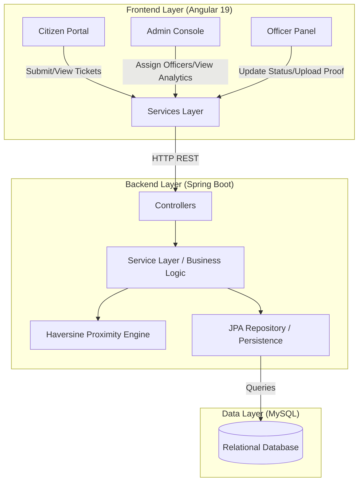

# CivicPulse - Intelligent Grievance Management System


CivicPulse is a modern, full-stack, state-of-the-art web platform engineered to bridge the gap between citizens, city administrators, and field officers. Built with a stunning dark "glassmorphism" aesthetic, it streamlines the reporting, assignment, and resolution of civic issues—from water leaks and potholes to electricity outages.

## 🚀 Key Features

### 👤 Role-Based Portals
*   **Citizen Dashboard:** An intuitive portal for citizens to submit grievances, upload photo evidence, provide precise geolocation (latitude/longitude), and track issue resolution status. Includes a dedicated feedback & rating module for resolved issues.
*   **Admin Console:** A master overview for administrators to orchestrate city-wide resources. Includes a rich data table for monitoring issues and a smart assignment workflow for delegating tasks.
*   **Officer Panel:** Dedicated workspace where field officers can receive tasks, manage resolution workflows, and upload final "after-fix" image proofs of their work.

### 🧠 Intelligent Assignment Engine
Gone are the days of manual, arbitrary task delegation. CivicPulse employs a dynamic recommendation engine to help Admins assign the right officer:
*   **Proximity-Based Routing:** Calculates distance using the Haversine formula based on the citizen's incident location and the officer's registered location coordinates.
*   **Department Matching:** Automatically filters available officers to match the exact department required by the grievance category (e.g., Water Supply, Electricity, Roads).
*   **Workload Balancing:** Displays real-time metrics showing how many tasks an officer currently has pending versus how many they have successfully resolved. 

### 📊 Analytics & Insights Hub
A dedicated `Chart.js` powered reporting module that transforms raw data into actionable intelligence:
*   **Status Distribution:** Interactive pie charts tracking real-time status breakdowns (Pending, In Progress, Resolved).
*   **Category Analysis:** Bar charts visualizing which departments are experiencing the highest friction.
*   **Service Level Agreements (SLA):** Tracks the average time (in days) taken to resolve tickets across different categories.
*   **Red Zone Detection:** Programmatically extracts location strings to identify high-frequency "Red Zones" where repeated complaints require systemic intervention.

### 🎨 Premium UI/UX Design
*   **Glassmorphism Theme:** Custom-built sleek, dark UI featuring frosted glass containers, dynamic gradient accents, and micro-animations.
*   **Global Navigation:** Sticky, consistent, layout-shifting-free routing with standardized dropdowns to eliminate "browser-default" aesthetic clashes.

---

## 🏛️ System Architecture

CivicPulse operates on a classic decoupled Client-Server architecture, ensuring high scalability and separation of concerns. The frontend and backend communicate exclusively via RESTful HTTP endpoints.



### Core Components
1. **Presentation Layer (Frontend):** 
   - Angular components handle state management and user interactions. Services inject `HttpClient` to communicate with the Spring Boot API. Reactive forms handle grievance submissions securely.
2. **Business Logic Layer (Backend):**
   - Built on Spring Boot. The `@RestController` layer defines endpoints, delegating heavy lifting to `@Service` classes. The services implement intelligent features like calculating optimal officer assignments using the Haversine formula on geolocation data.
3. **Data Access Layer:**
   - Hibernate/Spring Data JPA manages ORM (Object-Relational Mapping), bridging Java Entities (`User`, `Grievance`, `Department`) to the MySQL tables seamlessly.

---

## 🛠 Technology Stack

### Frontend
*   **Framework:** Angular 19
*   **Styling:** Custom CSS (Glassmorphism, Flexbox/Grid, CSS Variables)
*   **Routing:** Angular Router with Active Link Highlighting
*   **Data Visualization:** ng2-charts / Chart.js
*   **Forms:** Angular Reactive & Template-Driven Forms

### Backend
*   **Framework:** Java Spring Boot
*   **Database Integration:** Spring Data JPA / Hibernate (SQL)
*   **API Architecture:** RESTful Endpoints
*   **Authentication & State Route Guards:** Basic Role-Based Middleware 

---

## ⚙️ Local Development Setup

To test out CivicPulse on your local machine, run the backend and frontend simultaneously.

### 1. Spring Boot Backend
1. Ensure Java (JDK 21+) and your preferred SQL database are properly configured.
2. Navigate to the root directory `civic_pulse_hubK7-main`.
3. Start the Gradle wrapper:
   ```bash
   ./gradlew bootRun
   ```
4. *The server should spin up on `http://localhost:9090`.*

### 2. Angular Frontend
1. Navigate to the frontend directory:
   ```bash
   cd frontend
   ```
2. Install the necessary Node packages (Requires Node.js):
   ```bash
   npm install
   ```
3. Start the Angular Dev Server:
   ```bash
   npm start
   ```
4. *Access the application at `http://localhost:4200`.*

---

## 📂 Project Structure

```
civic_pulse_hubK7-main/
├── src/main/java/com/civic/smartcity/ # Spring Boot Backend
│   ├── controller/                    # REST APIs
│   ├── service/                       # Business Logic & Haversine formula
│   ├── repository/                    # Data Access Layer
│   └── model/                         # Entity Definitions
└── frontend/                          # Angular Frontend
    └── src/
        ├── app/
        │   ├── components/            # UI Views (Admin, Officer, Citizen, Reports)
        │   ├── models/                # TypeScript Interfaces
        │   ├── services/              # API Integration & Authentication 
        │   └── app.routes.ts          # Role-Based Route Definitions
        └── styles.css                 # Global CSS rules (Theme, Buttons, Selects)
```

## 🤝 Next Steps & Scalability
- **Push Notifications:** Integrate Firebase or WebSocket for real-world push alerts when a citizen's ticket is resolved.
- **Deep Analytics:** Expand the Red Zone module with integration to a Map API (like Google Maps or Leaflet) for literal heatmap plotting.

---

## 🏃🏽‍♂️ How to Run This Project

To get the full CivicPulse application running on your local machine, follow these steps to run both the backend server and the frontend client simultaneously.

### Step 1: Clone the Repository
Open your terminal and clone the main project repository to your local system.

### Step 2: Run the Spring Boot Backend (Java)
The backend powers the intelligent assignment engine and data storage.
1. Open a terminal and navigate to the root directory `civic_pulse_hubK7-main/`.
2. Ensure you have Java 21+ installed and MySQL running.
3. Build and run the project using the Gradle wrapper:
   * **Windows:** `.\gradlew.bat bootRun`
   * **Mac/Linux:** `./gradlew bootRun`
4. The server will start successfully on `http://localhost:9090`.

### Step 3: Run the Angular Frontend (Node.js)
The frontend serves the stunning glassmorphism interface.
1. Open a new, separate terminal.
2. Navigate directly into the frontend directory:
   ```bash
   cd civic_pulse_hubK7-main/frontend
   ```
3. Install all necessary dependencies (requires Node.js):
   ```bash
   npm install
   ```
4. Start the Angular development server:
   ```bash
   npm start
   ```
5. *Once built, open your browser and navigate to the application at `http://localhost:4200`.*
